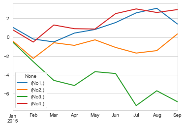
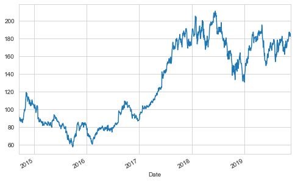
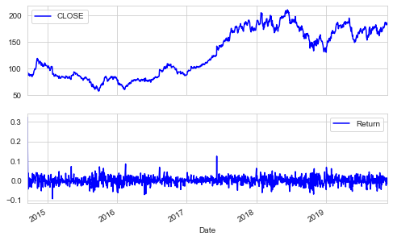
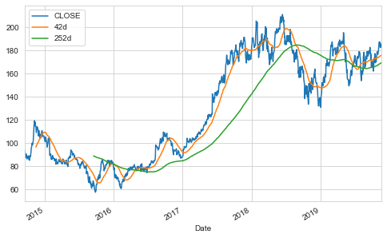
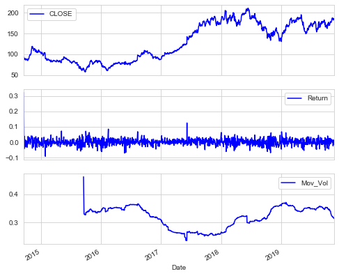
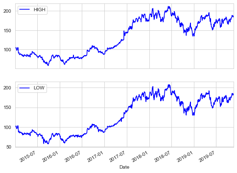
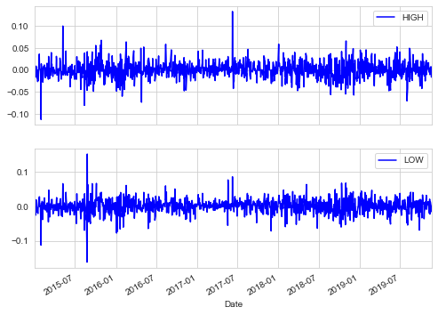
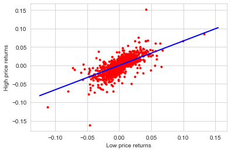
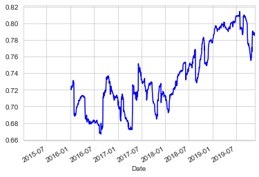
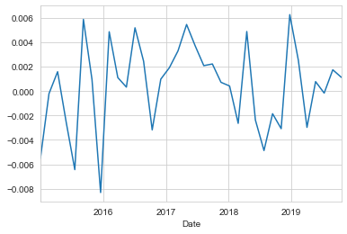

```python
from ImportAll import *
from Functions import *
```

# Chapter 6. Financial Time Series


```python
df = pd.DataFrame([10, 20, 30, 40], columns=['numbers'],index=['a', 'b', 'c', 'd'])
df
```


<div>
<style scoped>
    .dataframe tbody tr th:only-of-type {
        vertical-align: middle;
    }

    .dataframe tbody tr th {
        vertical-align: top;
    }

    .dataframe thead th {
        text-align: right;
    }
</style>
<table border="1" class="dataframe">
  <thead>
    <tr style="text-align: right;">
      <th></th>
      <th>numbers</th>
    </tr>
  </thead>
  <tbody>
    <tr>
      <th>a</th>
      <td>10</td>
    </tr>
    <tr>
      <th>b</th>
      <td>20</td>
    </tr>
    <tr>
      <th>c</th>
      <td>30</td>
    </tr>
    <tr>
      <th>d</th>
      <td>40</td>
    </tr>
  </tbody>
</table>
</div>


```python
df.loc['c']
```


    numbers    30
    Name: c, dtype: int64


```python
df.loc[['a','c']]
```


<div>
<style scoped>
    .dataframe tbody tr th:only-of-type {
        vertical-align: middle;
    }

    .dataframe tbody tr th {
        vertical-align: top;
    }

    .dataframe thead th {
        text-align: right;
    }
</style>
<table border="1" class="dataframe">
  <thead>
    <tr style="text-align: right;">
      <th></th>
      <th>numbers</th>
    </tr>
  </thead>
  <tbody>
    <tr>
      <th>a</th>
      <td>10</td>
    </tr>
    <tr>
      <th>c</th>
      <td>30</td>
    </tr>
  </tbody>
</table>
</div>


```python
df.sum()
```


    numbers    100
    dtype: int64


```python
df.apply(lambda x:x**2)
```


<div>
<style scoped>
    .dataframe tbody tr th:only-of-type {
        vertical-align: middle;
    }

    .dataframe tbody tr th {
        vertical-align: top;
    }

    .dataframe thead th {
        text-align: right;
    }
</style>
<table border="1" class="dataframe">
  <thead>
    <tr style="text-align: right;">
      <th></th>
      <th>numbers</th>
    </tr>
  </thead>
  <tbody>
    <tr>
      <th>a</th>
      <td>100</td>
    </tr>
    <tr>
      <th>b</th>
      <td>400</td>
    </tr>
    <tr>
      <th>c</th>
      <td>900</td>
    </tr>
    <tr>
      <th>d</th>
      <td>1600</td>
    </tr>
  </tbody>
</table>
</div>


```python
df**2
```


<div>
<style scoped>
    .dataframe tbody tr th:only-of-type {
        vertical-align: middle;
    }

    .dataframe tbody tr th {
        vertical-align: top;
    }

    .dataframe thead th {
        text-align: right;
    }
</style>
<table border="1" class="dataframe">
  <thead>
    <tr style="text-align: right;">
      <th></th>
      <th>numbers</th>
    </tr>
  </thead>
  <tbody>
    <tr>
      <th>a</th>
      <td>100</td>
    </tr>
    <tr>
      <th>b</th>
      <td>400</td>
    </tr>
    <tr>
      <th>c</th>
      <td>900</td>
    </tr>
    <tr>
      <th>d</th>
      <td>1600</td>
    </tr>
  </tbody>
</table>
</div>


```python
df['floats'] = (1.5, 2.5, 3.5, 4.5);
df
```


<div>
<style scoped>
    .dataframe tbody tr th:only-of-type {
        vertical-align: middle;
    }

    .dataframe tbody tr th {
        vertical-align: top;
    }

    .dataframe thead th {
        text-align: right;
    }
</style>
<table border="1" class="dataframe">
  <thead>
    <tr style="text-align: right;">
      <th></th>
      <th>numbers</th>
      <th>floats</th>
    </tr>
  </thead>
  <tbody>
    <tr>
      <th>a</th>
      <td>10</td>
      <td>1.5</td>
    </tr>
    <tr>
      <th>b</th>
      <td>20</td>
      <td>2.5</td>
    </tr>
    <tr>
      <th>c</th>
      <td>30</td>
      <td>3.5</td>
    </tr>
    <tr>
      <th>d</th>
      <td>40</td>
      <td>4.5</td>
    </tr>
  </tbody>
</table>
</div>


```python
df['names'] = pd.DataFrame(['Yves', 'Guido', 'Felix', 'Francesc'],
index=['d', 'a', 'b', 'c']);
df
```


<div>
<style scoped>
    .dataframe tbody tr th:only-of-type {
        vertical-align: middle;
    }

    .dataframe tbody tr th {
        vertical-align: top;
    }

    .dataframe thead th {
        text-align: right;
    }
</style>
<table border="1" class="dataframe">
  <thead>
    <tr style="text-align: right;">
      <th></th>
      <th>numbers</th>
      <th>floats</th>
      <th>names</th>
    </tr>
  </thead>
  <tbody>
    <tr>
      <th>a</th>
      <td>10</td>
      <td>1.5</td>
      <td>Guido</td>
    </tr>
    <tr>
      <th>b</th>
      <td>20</td>
      <td>2.5</td>
      <td>Felix</td>
    </tr>
    <tr>
      <th>c</th>
      <td>30</td>
      <td>3.5</td>
      <td>Francesc</td>
    </tr>
    <tr>
      <th>d</th>
      <td>40</td>
      <td>4.5</td>
      <td>Yves</td>
    </tr>
  </tbody>
</table>
</div>


```python
df.append({'numbers': 100, 'floats': 5.75, 'names': 'Henry'},
ignore_index=True)
```


<div>
<style scoped>
    .dataframe tbody tr th:only-of-type {
        vertical-align: middle;
    }

    .dataframe tbody tr th {
        vertical-align: top;
    }

    .dataframe thead th {
        text-align: right;
    }
</style>
<table border="1" class="dataframe">
  <thead>
    <tr style="text-align: right;">
      <th></th>
      <th>numbers</th>
      <th>floats</th>
      <th>names</th>
    </tr>
  </thead>
  <tbody>
    <tr>
      <th>0</th>
      <td>10</td>
      <td>1.50</td>
      <td>Guido</td>
    </tr>
    <tr>
      <th>1</th>
      <td>20</td>
      <td>2.50</td>
      <td>Felix</td>
    </tr>
    <tr>
      <th>2</th>
      <td>30</td>
      <td>3.50</td>
      <td>Francesc</td>
    </tr>
    <tr>
      <th>3</th>
      <td>40</td>
      <td>4.50</td>
      <td>Yves</td>
    </tr>
    <tr>
      <th>4</th>
      <td>100</td>
      <td>5.75</td>
      <td>Henry</td>
    </tr>
  </tbody>
</table>
</div>


```python
df = df.append(pd.DataFrame({'numbers': 100, 'floats': 5.75,
'names': 'Henry'}, index=['z',]));
df
```


<div>
<style scoped>
    .dataframe tbody tr th:only-of-type {
        vertical-align: middle;
    }

    .dataframe tbody tr th {
        vertical-align: top;
    }

    .dataframe thead th {
        text-align: right;
    }
</style>
<table border="1" class="dataframe">
  <thead>
    <tr style="text-align: right;">
      <th></th>
      <th>numbers</th>
      <th>floats</th>
      <th>names</th>
    </tr>
  </thead>
  <tbody>
    <tr>
      <th>a</th>
      <td>10</td>
      <td>1.50</td>
      <td>Guido</td>
    </tr>
    <tr>
      <th>b</th>
      <td>20</td>
      <td>2.50</td>
      <td>Felix</td>
    </tr>
    <tr>
      <th>c</th>
      <td>30</td>
      <td>3.50</td>
      <td>Francesc</td>
    </tr>
    <tr>
      <th>d</th>
      <td>40</td>
      <td>4.50</td>
      <td>Yves</td>
    </tr>
    <tr>
      <th>z</th>
      <td>100</td>
      <td>5.75</td>
      <td>Henry</td>
    </tr>
  </tbody>
</table>
</div>


```python
df.join(pd.DataFrame([1, 4, 9, 16, 25],
index=['a', 'b', 'c', 'd', 'y'],
columns=['squares',]))
```


<div>
<style scoped>
    .dataframe tbody tr th:only-of-type {
        vertical-align: middle;
    }

    .dataframe tbody tr th {
        vertical-align: top;
    }

    .dataframe thead th {
        text-align: right;
    }
</style>
<table border="1" class="dataframe">
  <thead>
    <tr style="text-align: right;">
      <th></th>
      <th>numbers</th>
      <th>floats</th>
      <th>names</th>
      <th>squares</th>
    </tr>
  </thead>
  <tbody>
    <tr>
      <th>a</th>
      <td>10</td>
      <td>1.50</td>
      <td>Guido</td>
      <td>1.0</td>
    </tr>
    <tr>
      <th>b</th>
      <td>20</td>
      <td>2.50</td>
      <td>Felix</td>
      <td>4.0</td>
    </tr>
    <tr>
      <th>c</th>
      <td>30</td>
      <td>3.50</td>
      <td>Francesc</td>
      <td>9.0</td>
    </tr>
    <tr>
      <th>d</th>
      <td>40</td>
      <td>4.50</td>
      <td>Yves</td>
      <td>16.0</td>
    </tr>
    <tr>
      <th>z</th>
      <td>100</td>
      <td>5.75</td>
      <td>Henry</td>
      <td>NaN</td>
    </tr>
  </tbody>
</table>
</div>


```python
df = df.join(pd.DataFrame([1, 4, 9, 16, 25],
index=['a', 'b', 'c', 'd', 'y'],
columns=['squares',]),
how='outer');
df
```


<div>
<style scoped>
    .dataframe tbody tr th:only-of-type {
        vertical-align: middle;
    }

    .dataframe tbody tr th {
        vertical-align: top;
    }

    .dataframe thead th {
        text-align: right;
    }
</style>
<table border="1" class="dataframe">
  <thead>
    <tr style="text-align: right;">
      <th></th>
      <th>numbers</th>
      <th>floats</th>
      <th>names</th>
      <th>squares</th>
    </tr>
  </thead>
  <tbody>
    <tr>
      <th>a</th>
      <td>10.0</td>
      <td>1.50</td>
      <td>Guido</td>
      <td>1.0</td>
    </tr>
    <tr>
      <th>b</th>
      <td>20.0</td>
      <td>2.50</td>
      <td>Felix</td>
      <td>4.0</td>
    </tr>
    <tr>
      <th>c</th>
      <td>30.0</td>
      <td>3.50</td>
      <td>Francesc</td>
      <td>9.0</td>
    </tr>
    <tr>
      <th>d</th>
      <td>40.0</td>
      <td>4.50</td>
      <td>Yves</td>
      <td>16.0</td>
    </tr>
    <tr>
      <th>y</th>
      <td>NaN</td>
      <td>NaN</td>
      <td>NaN</td>
      <td>25.0</td>
    </tr>
    <tr>
      <th>z</th>
      <td>100.0</td>
      <td>5.75</td>
      <td>Henry</td>
      <td>NaN</td>
    </tr>
  </tbody>
</table>
</div>


```python
df[['numbers', 'squares']].mean()
# column-wise mean
```


    numbers    40.0
    squares    11.0
    dtype: float64


```python
df[['numbers', 'squares']].std()
# column-wise standard deviation
```


    numbers    35.355339
    squares     9.669540
    dtype: float64


```python
a=np.random.standard_normal((9,4));#9行4列
a
```


    array([[ 1.05631146, -0.39492309, -0.50782347,  0.79089661],
           [-1.25451312, -1.85942726, -2.08722531, -1.30847874],
           [-0.30491319,  1.66549517, -1.98923878,  1.81123665],
           [ 0.93774461, -0.27946301, -0.54128828, -0.39456625],
           [ 0.38160539,  0.58582932,  1.46541121, -0.03381449],
           [ 0.734306  , -0.80564556, -0.19398534,  1.63419433],
           [ 1.02624368, -0.59883165, -3.40190617,  0.4965247 ],
           [ 0.48621181,  0.26012468,  1.57249662, -0.37715269],
           [-1.66134984,  1.76671979, -1.16008562,  0.30608404]])


```python
df=pd.DataFrame(a);
df
```


<div>
<style scoped>
    .dataframe tbody tr th:only-of-type {
        vertical-align: middle;
    }

    .dataframe tbody tr th {
        vertical-align: top;
    }

    .dataframe thead th {
        text-align: right;
    }
</style>
<table border="1" class="dataframe">
  <thead>
    <tr style="text-align: right;">
      <th></th>
      <th>0</th>
      <th>1</th>
      <th>2</th>
      <th>3</th>
    </tr>
  </thead>
  <tbody>
    <tr>
      <th>0</th>
      <td>1.056311</td>
      <td>-0.394923</td>
      <td>-0.507823</td>
      <td>0.790897</td>
    </tr>
    <tr>
      <th>1</th>
      <td>-1.254513</td>
      <td>-1.859427</td>
      <td>-2.087225</td>
      <td>-1.308479</td>
    </tr>
    <tr>
      <th>2</th>
      <td>-0.304913</td>
      <td>1.665495</td>
      <td>-1.989239</td>
      <td>1.811237</td>
    </tr>
    <tr>
      <th>3</th>
      <td>0.937745</td>
      <td>-0.279463</td>
      <td>-0.541288</td>
      <td>-0.394566</td>
    </tr>
    <tr>
      <th>4</th>
      <td>0.381605</td>
      <td>0.585829</td>
      <td>1.465411</td>
      <td>-0.033814</td>
    </tr>
    <tr>
      <th>5</th>
      <td>0.734306</td>
      <td>-0.805646</td>
      <td>-0.193985</td>
      <td>1.634194</td>
    </tr>
    <tr>
      <th>6</th>
      <td>1.026244</td>
      <td>-0.598832</td>
      <td>-3.401906</td>
      <td>0.496525</td>
    </tr>
    <tr>
      <th>7</th>
      <td>0.486212</td>
      <td>0.260125</td>
      <td>1.572497</td>
      <td>-0.377153</td>
    </tr>
    <tr>
      <th>8</th>
      <td>-1.661350</td>
      <td>1.766720</td>
      <td>-1.160086</td>
      <td>0.306084</td>
    </tr>
  </tbody>
</table>
</div>


```python
df.columns = [['No1', 'No2', 'No3', 'No4']];
df
```


<div>
<style scoped>
    .dataframe tbody tr th:only-of-type {
        vertical-align: middle;
    }

    .dataframe tbody tr th {
        vertical-align: top;
    }

    .dataframe thead tr th {
        text-align: left;
    }
</style>
<table border="1" class="dataframe">
  <thead>
    <tr>
      <th></th>
      <th>No1</th>
      <th>No2</th>
      <th>No3</th>
      <th>No4</th>
    </tr>
  </thead>
  <tbody>
    <tr>
      <th>0</th>
      <td>1.056311</td>
      <td>-0.394923</td>
      <td>-0.507823</td>
      <td>0.790897</td>
    </tr>
    <tr>
      <th>1</th>
      <td>-1.254513</td>
      <td>-1.859427</td>
      <td>-2.087225</td>
      <td>-1.308479</td>
    </tr>
    <tr>
      <th>2</th>
      <td>-0.304913</td>
      <td>1.665495</td>
      <td>-1.989239</td>
      <td>1.811237</td>
    </tr>
    <tr>
      <th>3</th>
      <td>0.937745</td>
      <td>-0.279463</td>
      <td>-0.541288</td>
      <td>-0.394566</td>
    </tr>
    <tr>
      <th>4</th>
      <td>0.381605</td>
      <td>0.585829</td>
      <td>1.465411</td>
      <td>-0.033814</td>
    </tr>
    <tr>
      <th>5</th>
      <td>0.734306</td>
      <td>-0.805646</td>
      <td>-0.193985</td>
      <td>1.634194</td>
    </tr>
    <tr>
      <th>6</th>
      <td>1.026244</td>
      <td>-0.598832</td>
      <td>-3.401906</td>
      <td>0.496525</td>
    </tr>
    <tr>
      <th>7</th>
      <td>0.486212</td>
      <td>0.260125</td>
      <td>1.572497</td>
      <td>-0.377153</td>
    </tr>
    <tr>
      <th>8</th>
      <td>-1.661350</td>
      <td>1.766720</td>
      <td>-1.160086</td>
      <td>0.306084</td>
    </tr>
  </tbody>
</table>
</div>


```python
df.loc[3]['No2']
```


    No2   -0.279463
    Name: 3, dtype: float64


```python
dates=pd.date_range('2015-1-1',periods=9,freq='M');
dates
```


    DatetimeIndex(['2015-01-31', '2015-02-28', '2015-03-31', '2015-04-30',
                   '2015-05-31', '2015-06-30', '2015-07-31', '2015-08-31',
                   '2015-09-30'],
                  dtype='datetime64[ns]', freq='M')


```python
df.index=dates;
df
```


<div>
<style scoped>
    .dataframe tbody tr th:only-of-type {
        vertical-align: middle;
    }

    .dataframe tbody tr th {
        vertical-align: top;
    }

    .dataframe thead tr th {
        text-align: left;
    }
</style>
<table border="1" class="dataframe">
  <thead>
    <tr>
      <th></th>
      <th>No1</th>
      <th>No2</th>
      <th>No3</th>
      <th>No4</th>
    </tr>
  </thead>
  <tbody>
    <tr>
      <th>2015-01-31</th>
      <td>1.056311</td>
      <td>-0.394923</td>
      <td>-0.507823</td>
      <td>0.790897</td>
    </tr>
    <tr>
      <th>2015-02-28</th>
      <td>-1.254513</td>
      <td>-1.859427</td>
      <td>-2.087225</td>
      <td>-1.308479</td>
    </tr>
    <tr>
      <th>2015-03-31</th>
      <td>-0.304913</td>
      <td>1.665495</td>
      <td>-1.989239</td>
      <td>1.811237</td>
    </tr>
    <tr>
      <th>2015-04-30</th>
      <td>0.937745</td>
      <td>-0.279463</td>
      <td>-0.541288</td>
      <td>-0.394566</td>
    </tr>
    <tr>
      <th>2015-05-31</th>
      <td>0.381605</td>
      <td>0.585829</td>
      <td>1.465411</td>
      <td>-0.033814</td>
    </tr>
    <tr>
      <th>2015-06-30</th>
      <td>0.734306</td>
      <td>-0.805646</td>
      <td>-0.193985</td>
      <td>1.634194</td>
    </tr>
    <tr>
      <th>2015-07-31</th>
      <td>1.026244</td>
      <td>-0.598832</td>
      <td>-3.401906</td>
      <td>0.496525</td>
    </tr>
    <tr>
      <th>2015-08-31</th>
      <td>0.486212</td>
      <td>0.260125</td>
      <td>1.572497</td>
      <td>-0.377153</td>
    </tr>
    <tr>
      <th>2015-09-30</th>
      <td>-1.661350</td>
      <td>1.766720</td>
      <td>-1.160086</td>
      <td>0.306084</td>
    </tr>
  </tbody>
</table>
</div>


```python
np.array(df).round(6)
```


    array([[ 1.056311, -0.394923, -0.507823,  0.790897],
           [-1.254513, -1.859427, -2.087225, -1.308479],
           [-0.304913,  1.665495, -1.989239,  1.811237],
           [ 0.937745, -0.279463, -0.541288, -0.394566],
           [ 0.381605,  0.585829,  1.465411, -0.033814],
           [ 0.734306, -0.805646, -0.193985,  1.634194],
           [ 1.026244, -0.598832, -3.401906,  0.496525],
           [ 0.486212,  0.260125,  1.572497, -0.377153],
           [-1.66135 ,  1.76672 , -1.160086,  0.306084]])


```python
df.cumsum()
```


<div>
<style scoped>
    .dataframe tbody tr th:only-of-type {
        vertical-align: middle;
    }

    .dataframe tbody tr th {
        vertical-align: top;
    }

    .dataframe thead tr th {
        text-align: left;
    }
</style>
<table border="1" class="dataframe">
  <thead>
    <tr>
      <th></th>
      <th>No1</th>
      <th>No2</th>
      <th>No3</th>
      <th>No4</th>
    </tr>
  </thead>
  <tbody>
    <tr>
      <th>2015-01-31</th>
      <td>1.056311</td>
      <td>-0.394923</td>
      <td>-0.507823</td>
      <td>0.790897</td>
    </tr>
    <tr>
      <th>2015-02-28</th>
      <td>-0.198202</td>
      <td>-2.254350</td>
      <td>-2.595049</td>
      <td>-0.517582</td>
    </tr>
    <tr>
      <th>2015-03-31</th>
      <td>-0.503115</td>
      <td>-0.588855</td>
      <td>-4.584288</td>
      <td>1.293655</td>
    </tr>
    <tr>
      <th>2015-04-30</th>
      <td>0.434630</td>
      <td>-0.868318</td>
      <td>-5.125576</td>
      <td>0.899088</td>
    </tr>
    <tr>
      <th>2015-05-31</th>
      <td>0.816235</td>
      <td>-0.282489</td>
      <td>-3.660165</td>
      <td>0.865274</td>
    </tr>
    <tr>
      <th>2015-06-30</th>
      <td>1.550541</td>
      <td>-1.088134</td>
      <td>-3.854150</td>
      <td>2.499468</td>
    </tr>
    <tr>
      <th>2015-07-31</th>
      <td>2.576785</td>
      <td>-1.686966</td>
      <td>-7.256056</td>
      <td>2.995993</td>
    </tr>
    <tr>
      <th>2015-08-31</th>
      <td>3.062997</td>
      <td>-1.426841</td>
      <td>-5.683560</td>
      <td>2.618840</td>
    </tr>
    <tr>
      <th>2015-09-30</th>
      <td>1.401647</td>
      <td>0.339878</td>
      <td>-6.843645</td>
      <td>2.924924</td>
    </tr>
  </tbody>
</table>
</div>


```python
df.describe()
```


<div>
<style scoped>
    .dataframe tbody tr th:only-of-type {
        vertical-align: middle;
    }

    .dataframe tbody tr th {
        vertical-align: top;
    }

    .dataframe thead tr th {
        text-align: left;
    }
</style>
<table border="1" class="dataframe">
  <thead>
    <tr>
      <th></th>
      <th>No1</th>
      <th>No2</th>
      <th>No3</th>
      <th>No4</th>
    </tr>
  </thead>
  <tbody>
    <tr>
      <th>count</th>
      <td>9.000000</td>
      <td>9.000000</td>
      <td>9.000000</td>
      <td>9.000000</td>
    </tr>
    <tr>
      <th>mean</th>
      <td>0.155739</td>
      <td>0.037764</td>
      <td>-0.760405</td>
      <td>0.324992</td>
    </tr>
    <tr>
      <th>std</th>
      <td>1.011072</td>
      <td>1.172199</td>
      <td>1.629305</td>
      <td>0.998594</td>
    </tr>
    <tr>
      <th>min</th>
      <td>-1.661350</td>
      <td>-1.859427</td>
      <td>-3.401906</td>
      <td>-1.308479</td>
    </tr>
    <tr>
      <th>25%</th>
      <td>-0.304913</td>
      <td>-0.598832</td>
      <td>-1.989239</td>
      <td>-0.377153</td>
    </tr>
    <tr>
      <th>50%</th>
      <td>0.486212</td>
      <td>-0.279463</td>
      <td>-0.541288</td>
      <td>0.306084</td>
    </tr>
    <tr>
      <th>75%</th>
      <td>0.937745</td>
      <td>0.585829</td>
      <td>-0.193985</td>
      <td>0.790897</td>
    </tr>
    <tr>
      <th>max</th>
      <td>1.056311</td>
      <td>1.766720</td>
      <td>1.572497</td>
      <td>1.811237</td>
    </tr>
  </tbody>
</table>
</div>


```python
np.sqrt(df) #开方，负值为na
```

    /Users/Xiran/anaconda/lib/python3.6/site-packages/ipykernel_launcher.py:1: RuntimeWarning: invalid value encountered in sqrt
      """Entry point for launching an IPython kernel.


<div>
<style scoped>
    .dataframe tbody tr th:only-of-type {
        vertical-align: middle;
    }

    .dataframe tbody tr th {
        vertical-align: top;
    }

    .dataframe thead tr th {
        text-align: left;
    }
</style>
<table border="1" class="dataframe">
  <thead>
    <tr>
      <th></th>
      <th>No1</th>
      <th>No2</th>
      <th>No3</th>
      <th>No4</th>
    </tr>
  </thead>
  <tbody>
    <tr>
      <th>2015-01-31</th>
      <td>1.027770</td>
      <td>NaN</td>
      <td>NaN</td>
      <td>0.889324</td>
    </tr>
    <tr>
      <th>2015-02-28</th>
      <td>NaN</td>
      <td>NaN</td>
      <td>NaN</td>
      <td>NaN</td>
    </tr>
    <tr>
      <th>2015-03-31</th>
      <td>NaN</td>
      <td>1.290541</td>
      <td>NaN</td>
      <td>1.345822</td>
    </tr>
    <tr>
      <th>2015-04-30</th>
      <td>0.968372</td>
      <td>NaN</td>
      <td>NaN</td>
      <td>NaN</td>
    </tr>
    <tr>
      <th>2015-05-31</th>
      <td>0.617742</td>
      <td>0.765395</td>
      <td>1.210542</td>
      <td>NaN</td>
    </tr>
    <tr>
      <th>2015-06-30</th>
      <td>0.856917</td>
      <td>NaN</td>
      <td>NaN</td>
      <td>1.278356</td>
    </tr>
    <tr>
      <th>2015-07-31</th>
      <td>1.013037</td>
      <td>NaN</td>
      <td>NaN</td>
      <td>0.704645</td>
    </tr>
    <tr>
      <th>2015-08-31</th>
      <td>0.697289</td>
      <td>0.510024</td>
      <td>1.253992</td>
      <td>NaN</td>
    </tr>
    <tr>
      <th>2015-09-30</th>
      <td>NaN</td>
      <td>1.329180</td>
      <td>NaN</td>
      <td>0.553249</td>
    </tr>
  </tbody>
</table>
</div>


```python
np.sqrt(df).sum()
```

    /Users/Xiran/anaconda/lib/python3.6/site-packages/ipykernel_launcher.py:1: RuntimeWarning: invalid value encountered in sqrt
      """Entry point for launching an IPython kernel.


    No1    5.181127
    No2    3.895140
    No3    2.464534
    No4    4.771395
    dtype: float64


```python
df.cumsum().plot(lw=2.0)
#align_figures()
```


    <matplotlib.axes._subplots.AxesSubplot at 0x1c1fd48358>





```python
import pandas_datareader.data as web
```


```python
#从万得API获取阿里巴巴美股数据
'''
from WindPy import *
data1=w.wsd("BABA.N", "pre_close,open,high,low,close,volume", "2014-09-19", "2019-11-21", "TradingCalendar=NYSE",usedf=False)
dfBABAn=pd.DataFrame(data=data1.Data,index=data1.Fields,columns=data1.Times).T
'''
```


    '\nfrom WindPy import *\ndata1=w.wsd("BABA.N", "pre_close,open,high,low,close,volume", "2014-09-19", "2019-11-21", "TradingCalendar=NYSE",usedf=False)\ndfBABAn=pd.DataFrame(data=data1.Data,index=data1.Fields,columns=data1.Times).T\n'


```python
dfBABAn=pd.read_excel('BABAn.xlsx')
dfBABAn.rename({'Unnamed: 0':'Date'},axis=1,inplace=True)
dfBABAn.set_index('Date',inplace=True)
```


```python
dfBABAn.tail()
```


<div>
<style scoped>
    .dataframe tbody tr th:only-of-type {
        vertical-align: middle;
    }

    .dataframe tbody tr th {
        vertical-align: top;
    }

    .dataframe thead th {
        text-align: right;
    }
</style>
<table border="1" class="dataframe">
  <thead>
    <tr style="text-align: right;">
      <th></th>
      <th>PRE_CLOSE</th>
      <th>OPEN</th>
      <th>HIGH</th>
      <th>LOW</th>
      <th>CLOSE</th>
      <th>VOLUME</th>
    </tr>
    <tr>
      <th>Date</th>
      <th></th>
      <th></th>
      <th></th>
      <th></th>
      <th></th>
      <th></th>
    </tr>
  </thead>
  <tbody>
    <tr>
      <th>2019-11-15</th>
      <td>182.80</td>
      <td>184.00</td>
      <td>185.60</td>
      <td>183.71</td>
      <td>185.49</td>
      <td>11312540.0</td>
    </tr>
    <tr>
      <th>2019-11-18</th>
      <td>185.49</td>
      <td>186.98</td>
      <td>186.98</td>
      <td>184.16</td>
      <td>184.61</td>
      <td>11830910.0</td>
    </tr>
    <tr>
      <th>2019-11-19</th>
      <td>184.61</td>
      <td>186.31</td>
      <td>186.71</td>
      <td>183.87</td>
      <td>185.25</td>
      <td>13457360.0</td>
    </tr>
    <tr>
      <th>2019-11-20</th>
      <td>185.25</td>
      <td>183.67</td>
      <td>183.70</td>
      <td>181.06</td>
      <td>182.35</td>
      <td>16689266.0</td>
    </tr>
    <tr>
      <th>2019-11-21</th>
      <td>182.35</td>
      <td>NaN</td>
      <td>NaN</td>
      <td>NaN</td>
      <td>182.35</td>
      <td>NaN</td>
    </tr>
  </tbody>
</table>
</div>


```python
#价格走势
dfBABAn['CLOSE'].plot(figsize=(8,5))
#align_figures()
```


    <matplotlib.axes._subplots.AxesSubplot at 0x1c1fd10f28>





```python
#计算log return
dfBABAn['Return']=np.log(dfBABAn['CLOSE']/dfBABAn['CLOSE'].shift(1))
dfBABAn[['CLOSE','Return']].head()
```


<div>
<style scoped>
    .dataframe tbody tr th:only-of-type {
        vertical-align: middle;
    }

    .dataframe tbody tr th {
        vertical-align: top;
    }

    .dataframe thead th {
        text-align: right;
    }
</style>
<table border="1" class="dataframe">
  <thead>
    <tr style="text-align: right;">
      <th></th>
      <th>CLOSE</th>
      <th>Return</th>
    </tr>
    <tr>
      <th>Date</th>
      <th></th>
      <th></th>
    </tr>
  </thead>
  <tbody>
    <tr>
      <th>2014-09-19</th>
      <td>93.89</td>
      <td>NaN</td>
    </tr>
    <tr>
      <th>2014-09-22</th>
      <td>89.89</td>
      <td>-0.043537</td>
    </tr>
    <tr>
      <th>2014-09-23</th>
      <td>87.17</td>
      <td>-0.030726</td>
    </tr>
    <tr>
      <th>2014-09-24</th>
      <td>90.57</td>
      <td>0.038263</td>
    </tr>
    <tr>
      <th>2014-09-25</th>
      <td>88.92</td>
      <td>-0.018386</td>
    </tr>
  </tbody>
</table>
</div>


```python
dfBABAn.loc[dfBABAn.index[0]]['Return']=np.log(dfBABAn.loc[dfBABAn.index[0]]['CLOSE']
                                                /dfBABAn.loc[dfBABAn.index[0]]['PRE_CLOSE'])
dfBABAn[['CLOSE','Return']].head()
```


<div>
<style scoped>
    .dataframe tbody tr th:only-of-type {
        vertical-align: middle;
    }

    .dataframe tbody tr th {
        vertical-align: top;
    }

    .dataframe thead th {
        text-align: right;
    }
</style>
<table border="1" class="dataframe">
  <thead>
    <tr style="text-align: right;">
      <th></th>
      <th>CLOSE</th>
      <th>Return</th>
    </tr>
    <tr>
      <th>Date</th>
      <th></th>
      <th></th>
    </tr>
  </thead>
  <tbody>
    <tr>
      <th>2014-09-19</th>
      <td>93.89</td>
      <td>0.322616</td>
    </tr>
    <tr>
      <th>2014-09-22</th>
      <td>89.89</td>
      <td>-0.043537</td>
    </tr>
    <tr>
      <th>2014-09-23</th>
      <td>87.17</td>
      <td>-0.030726</td>
    </tr>
    <tr>
      <th>2014-09-24</th>
      <td>90.57</td>
      <td>0.038263</td>
    </tr>
    <tr>
      <th>2014-09-25</th>
      <td>88.92</td>
      <td>-0.018386</td>
    </tr>
  </tbody>
</table>
</div>


```python
dfBABAn[['CLOSE','Return']].plot(subplots=True,style='b',figsize=(8,5))
#align_figures()
```


    array([<matplotlib.axes._subplots.AxesSubplot object at 0x1c1fc6c908>,
           <matplotlib.axes._subplots.AxesSubplot object at 0x1c1f600780>],
          dtype=object)





```python
#移动平均
dfBABAn['42d']=dfBABAn['CLOSE'].rolling(window=42).mean()
dfBABAn['252d']=dfBABAn['CLOSE'].rolling(window=252).mean()
dfBABAn.tail()
```


<div>
<style scoped>
    .dataframe tbody tr th:only-of-type {
        vertical-align: middle;
    }

    .dataframe tbody tr th {
        vertical-align: top;
    }

    .dataframe thead th {
        text-align: right;
    }
</style>
<table border="1" class="dataframe">
  <thead>
    <tr style="text-align: right;">
      <th></th>
      <th>PRE_CLOSE</th>
      <th>OPEN</th>
      <th>HIGH</th>
      <th>LOW</th>
      <th>CLOSE</th>
      <th>VOLUME</th>
      <th>Return</th>
      <th>42d</th>
      <th>252d</th>
    </tr>
    <tr>
      <th>Date</th>
      <th></th>
      <th></th>
      <th></th>
      <th></th>
      <th></th>
      <th></th>
      <th></th>
      <th></th>
      <th></th>
    </tr>
  </thead>
  <tbody>
    <tr>
      <th>2019-11-15</th>
      <td>182.80</td>
      <td>184.00</td>
      <td>185.60</td>
      <td>183.71</td>
      <td>185.49</td>
      <td>11312540.0</td>
      <td>0.014608</td>
      <td>175.277381</td>
      <td>168.850476</td>
    </tr>
    <tr>
      <th>2019-11-18</th>
      <td>185.49</td>
      <td>186.98</td>
      <td>186.98</td>
      <td>184.16</td>
      <td>184.61</td>
      <td>11830910.0</td>
      <td>-0.004755</td>
      <td>175.376190</td>
      <td>168.963135</td>
    </tr>
    <tr>
      <th>2019-11-19</th>
      <td>184.61</td>
      <td>186.31</td>
      <td>186.71</td>
      <td>183.87</td>
      <td>185.25</td>
      <td>13457360.0</td>
      <td>0.003461</td>
      <td>175.441429</td>
      <td>169.086746</td>
    </tr>
    <tr>
      <th>2019-11-20</th>
      <td>185.25</td>
      <td>183.67</td>
      <td>183.70</td>
      <td>181.06</td>
      <td>182.35</td>
      <td>16689266.0</td>
      <td>-0.015778</td>
      <td>175.569286</td>
      <td>169.216984</td>
    </tr>
    <tr>
      <th>2019-11-21</th>
      <td>182.35</td>
      <td>NaN</td>
      <td>NaN</td>
      <td>NaN</td>
      <td>182.35</td>
      <td>NaN</td>
      <td>0.000000</td>
      <td>175.826429</td>
      <td>169.361310</td>
    </tr>
  </tbody>
</table>
</div>


```python
dfBABAn[['CLOSE','42d','252d']].plot(figsize=(8,5))
#align_figures()
```


    <matplotlib.axes._subplots.AxesSubplot at 0x1c1f438438>





```python
#moving annual volatility
import math
dfBABAn['Mov_Vol']=dfBABAn['Return'].rolling(window=252).std()*math.sqrt(252)
dfBABAn.tail()
```


<div>
<style scoped>
    .dataframe tbody tr th:only-of-type {
        vertical-align: middle;
    }

    .dataframe tbody tr th {
        vertical-align: top;
    }

    .dataframe thead th {
        text-align: right;
    }
</style>
<table border="1" class="dataframe">
  <thead>
    <tr style="text-align: right;">
      <th></th>
      <th>PRE_CLOSE</th>
      <th>OPEN</th>
      <th>HIGH</th>
      <th>LOW</th>
      <th>CLOSE</th>
      <th>VOLUME</th>
      <th>Return</th>
      <th>42d</th>
      <th>252d</th>
      <th>Mov_Vol</th>
    </tr>
    <tr>
      <th>Date</th>
      <th></th>
      <th></th>
      <th></th>
      <th></th>
      <th></th>
      <th></th>
      <th></th>
      <th></th>
      <th></th>
      <th></th>
    </tr>
  </thead>
  <tbody>
    <tr>
      <th>2019-11-15</th>
      <td>182.80</td>
      <td>184.00</td>
      <td>185.60</td>
      <td>183.71</td>
      <td>185.49</td>
      <td>11312540.0</td>
      <td>0.014608</td>
      <td>175.277381</td>
      <td>168.850476</td>
      <td>0.317501</td>
    </tr>
    <tr>
      <th>2019-11-18</th>
      <td>185.49</td>
      <td>186.98</td>
      <td>186.98</td>
      <td>184.16</td>
      <td>184.61</td>
      <td>11830910.0</td>
      <td>-0.004755</td>
      <td>175.376190</td>
      <td>168.963135</td>
      <td>0.315383</td>
    </tr>
    <tr>
      <th>2019-11-19</th>
      <td>184.61</td>
      <td>186.31</td>
      <td>186.71</td>
      <td>183.87</td>
      <td>185.25</td>
      <td>13457360.0</td>
      <td>0.003461</td>
      <td>175.441429</td>
      <td>169.086746</td>
      <td>0.315067</td>
    </tr>
    <tr>
      <th>2019-11-20</th>
      <td>185.25</td>
      <td>183.67</td>
      <td>183.70</td>
      <td>181.06</td>
      <td>182.35</td>
      <td>16689266.0</td>
      <td>-0.015778</td>
      <td>175.569286</td>
      <td>169.216984</td>
      <td>0.313983</td>
    </tr>
    <tr>
      <th>2019-11-21</th>
      <td>182.35</td>
      <td>NaN</td>
      <td>NaN</td>
      <td>NaN</td>
      <td>182.35</td>
      <td>NaN</td>
      <td>0.000000</td>
      <td>175.826429</td>
      <td>169.361310</td>
      <td>0.312994</td>
    </tr>
  </tbody>
</table>
</div>


```python
dfBABAn[['CLOSE','Return','Mov_Vol']].plot(subplots=True,style='b',figsize=(8,7))
#align_figures()
```


    array([<matplotlib.axes._subplots.AxesSubplot object at 0x1c1f432748>,
           <matplotlib.axes._subplots.AxesSubplot object at 0x1c1f192080>,
           <matplotlib.axes._subplots.AxesSubplot object at 0x1c1f1cfd68>],
          dtype=object)





```python
#回归，wind接口坏了，只能拿现有数据
import datetime as dt
data=pd.DataFrame({'HIGH':
                  dfBABAn['HIGH'][dfBABAn.index>dt.datetime(2015,1,1)]})
data=data.join(pd.DataFrame({'LOW':
                            dfBABAn['LOW'][dfBABAn.index>dt.datetime(2015,1,1)]}))
```


```python
data=data.fillna(method='ffill')
data.info()
```

    <class 'pandas.core.frame.DataFrame'>
    DatetimeIndex: 1232 entries, 2015-01-02 to 2019-11-21
    Data columns (total 2 columns):
    HIGH    1232 non-null float64
    LOW     1232 non-null float64
    dtypes: float64(2)
    memory usage: 68.9 KB


```python
data.tail()
```


<div>
<style scoped>
    .dataframe tbody tr th:only-of-type {
        vertical-align: middle;
    }

    .dataframe tbody tr th {
        vertical-align: top;
    }

    .dataframe thead th {
        text-align: right;
    }
</style>
<table border="1" class="dataframe">
  <thead>
    <tr style="text-align: right;">
      <th></th>
      <th>HIGH</th>
      <th>LOW</th>
    </tr>
    <tr>
      <th>Date</th>
      <th></th>
      <th></th>
    </tr>
  </thead>
  <tbody>
    <tr>
      <th>2019-11-15</th>
      <td>185.60</td>
      <td>183.71</td>
    </tr>
    <tr>
      <th>2019-11-18</th>
      <td>186.98</td>
      <td>184.16</td>
    </tr>
    <tr>
      <th>2019-11-19</th>
      <td>186.71</td>
      <td>183.87</td>
    </tr>
    <tr>
      <th>2019-11-20</th>
      <td>183.70</td>
      <td>181.06</td>
    </tr>
    <tr>
      <th>2019-11-21</th>
      <td>183.70</td>
      <td>181.06</td>
    </tr>
  </tbody>
</table>
</div>


```python
data.plot(subplots=True,grid=True,style='b',figsize=(8,6))
#align_figures()
```


    array([<matplotlib.axes._subplots.AxesSubplot object at 0x1c1eeb45c0>,
           <matplotlib.axes._subplots.AxesSubplot object at 0x1c1ec77198>],
          dtype=object)





```python
rets=np.log(data/data.shift(1))
rets.head()
```


<div>
<style scoped>
    .dataframe tbody tr th:only-of-type {
        vertical-align: middle;
    }

    .dataframe tbody tr th {
        vertical-align: top;
    }

    .dataframe thead th {
        text-align: right;
    }
</style>
<table border="1" class="dataframe">
  <thead>
    <tr style="text-align: right;">
      <th></th>
      <th>HIGH</th>
      <th>LOW</th>
    </tr>
    <tr>
      <th>Date</th>
      <th></th>
      <th></th>
    </tr>
  </thead>
  <tbody>
    <tr>
      <th>2015-01-02</th>
      <td>NaN</td>
      <td>NaN</td>
    </tr>
    <tr>
      <th>2015-01-05</th>
      <td>-0.016367</td>
      <td>-0.025888</td>
    </tr>
    <tr>
      <th>2015-01-06</th>
      <td>0.008024</td>
      <td>0.002100</td>
    </tr>
    <tr>
      <th>2015-01-07</th>
      <td>0.008534</td>
      <td>0.018997</td>
    </tr>
    <tr>
      <th>2015-01-08</th>
      <td>0.005711</td>
      <td>0.006350</td>
    </tr>
  </tbody>
</table>
</div>


```python
rets.plot(subplots=True,grid=True,style='b',figsize=(8,6))
#align_figures()
```


    array([<matplotlib.axes._subplots.AxesSubplot object at 0x1c2001bbe0>,
           <matplotlib.axes._subplots.AxesSubplot object at 0x1c1f1c7710>],
          dtype=object)





```python
import statsmodels.formula.api as smf
model=smf.ols(formula='HIGH~LOW',data=rets).fit()
model.params
```


    Intercept    0.000151
    LOW          0.661693
    dtype: float64


```python
model.summary()
```


<table class="simpletable">
<caption>OLS Regression Results</caption>
<tr>
  <th>Dep. Variable:</th>          <td>HIGH</td>       <th>  R-squared:         </th> <td>   0.543</td> 
</tr>
<tr>
  <th>Model:</th>                   <td>OLS</td>       <th>  Adj. R-squared:    </th> <td>   0.543</td> 
</tr>
<tr>
  <th>Method:</th>             <td>Least Squares</td>  <th>  F-statistic:       </th> <td>   1460.</td> 
</tr>
<tr>
  <th>Date:</th>             <td>Sat, 14 Dec 2019</td> <th>  Prob (F-statistic):</th> <td>3.07e-211</td>
</tr>
<tr>
  <th>Time:</th>                 <td>21:26:56</td>     <th>  Log-Likelihood:    </th> <td>  3622.3</td> 
</tr>
<tr>
  <th>No. Observations:</th>      <td>  1231</td>      <th>  AIC:               </th> <td>  -7241.</td> 
</tr>
<tr>
  <th>Df Residuals:</th>          <td>  1229</td>      <th>  BIC:               </th> <td>  -7230.</td> 
</tr>
<tr>
  <th>Df Model:</th>              <td>     1</td>      <th>                     </th>     <td> </td>    
</tr>
<tr>
  <th>Covariance Type:</th>      <td>nonrobust</td>    <th>                     </th>     <td> </td>    
</tr>
</table>
<table class="simpletable">
<tr>
      <td></td>         <th>coef</th>     <th>std err</th>      <th>t</th>      <th>P>|t|</th>  <th>[0.025</th>    <th>0.975]</th>  
</tr>
<tr>
  <th>Intercept</th> <td>    0.0002</td> <td>    0.000</td> <td>    0.414</td> <td> 0.679</td> <td>   -0.001</td> <td>    0.001</td>
</tr>
<tr>
  <th>LOW</th>       <td>    0.6617</td> <td>    0.017</td> <td>   38.216</td> <td> 0.000</td> <td>    0.628</td> <td>    0.696</td>
</tr>
</table>
<table class="simpletable">
<tr>
  <th>Omnibus:</th>       <td>162.639</td> <th>  Durbin-Watson:     </th> <td>   2.642</td>
</tr>
<tr>
  <th>Prob(Omnibus):</th> <td> 0.000</td>  <th>  Jarque-Bera (JB):  </th> <td>1669.878</td>
</tr>
<tr>
  <th>Skew:</th>          <td> 0.159</td>  <th>  Prob(JB):          </th> <td>    0.00</td>
</tr>
<tr>
  <th>Kurtosis:</th>      <td> 8.697</td>  <th>  Cond. No.          </th> <td>    47.6</td>
</tr>
</table><br/><br/>Warnings:<br/>[1] Standard Errors assume that the covariance matrix of the errors is correctly specified.


```python
plt.plot(rets['HIGH'],rets['LOW'],'r.')
ax=plt.axis() #grab axis values
x=np.linspace(ax[0],ax[1]+0.01) #将x轴长度等分50份
plt.plot(x,model.params[0]+model.params[1]*x,'b',lw=2)
plt.grid=True
plt.axis('tight')
plt.xlabel('Low price returns')
plt.ylabel('High price returns')
#align_figures()
```


    Text(0, 0.5, 'High price returns')





```python
rets.corr()
```


<div>
<style scoped>
    .dataframe tbody tr th:only-of-type {
        vertical-align: middle;
    }

    .dataframe tbody tr th {
        vertical-align: top;
    }

    .dataframe thead th {
        text-align: right;
    }
</style>
<table border="1" class="dataframe">
  <thead>
    <tr style="text-align: right;">
      <th></th>
      <th>HIGH</th>
      <th>LOW</th>
    </tr>
  </thead>
  <tbody>
    <tr>
      <th>HIGH</th>
      <td>1.00000</td>
      <td>0.73691</td>
    </tr>
    <tr>
      <th>LOW</th>
      <td>0.73691</td>
      <td>1.00000</td>
    </tr>
  </tbody>
</table>
</div>


```python
#求rolling correlation
rets['HIGH'].rolling(252).corr(rets['LOW']).plot(grid=True,style='b')
#align_figures()
```


    <matplotlib.axes._subplots.AxesSubplot at 0x1c1f19a198>





```python
#重新取样
rets_resam=rets.resample(rule='50d').mean()
rets_resam['HIGH'].fillna(method='ffill').plot()
#align_figures()
```


    <matplotlib.axes._subplots.AxesSubplot at 0x1c1f3a7470>




